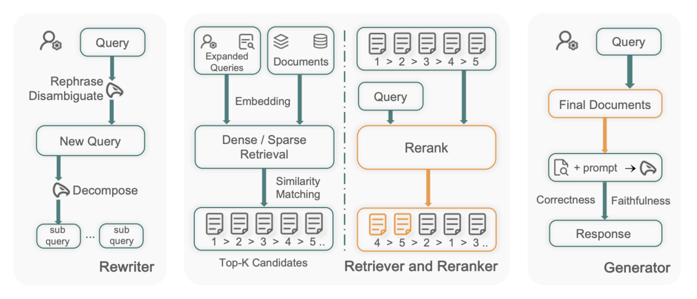

# Omni-RAG: LLM-Assisted Query Understanding



This project implements the core ideas of [Omni-RAG (Dong et al. 2025)](https://arxiv.org/abs/2506.21384): a Retrieval-Augmented Generation (RAG) system for real-world, noisy, and multi-intent queries.

---

## ✨ Key Features
- **LLM-based Query Understanding:** Rewriting and decomposing user queries into sub-queries
- **Intent-Aware Retrieval:** Vector search over external knowledge for each sub-query (e.g., FineWeb)
- **Reranking & Generation:** `BAAI/bge-base-en-v1.5` reranker and GPT-4.1-nano for final answer

---

## 🚀 Installation
```bash
# Clone repo and install dependencies
pip install -r requirements.txt

# Set up database and environment variables
cd docker
docker compose up -d
```

---

## Usage
1. Create a `.env` file with:
   - `TIMESCALE_SERVICE_URL`
   - `OPENAI_API_KEY`
2. Setup DB and upload data:
   ```bash
   python src/upload_vectors.py
   ```
3. Run the main pipeline:
   ```bash
   python src/main.py
   ```

---

## Technologies Used
- **Python 3.10+**
- **TimescaleDB (PostgreSQL)**
- **Docker**
- **FineWeb Dataset**
- **GPT-4.1-nano**
- **text-embedding-3-small**
- **BAAI/bge-base-en-v1.5**

### Python Packages
```
openai
numpy
timescale-vector
pandas
dotenv
sentence-transformers
transformers
pydantic
datasets
```

---

## 📖 Reference
- Dong, G. et al. (2025): [Omni-RAG: Leveraging LLM-Assisted Query Understanding for Live Retrieval-Augmented Generation](https://arxiv.org/abs/2506.21384)

---

*Research prototype inspired by the official Omni-RAG pipeline.*